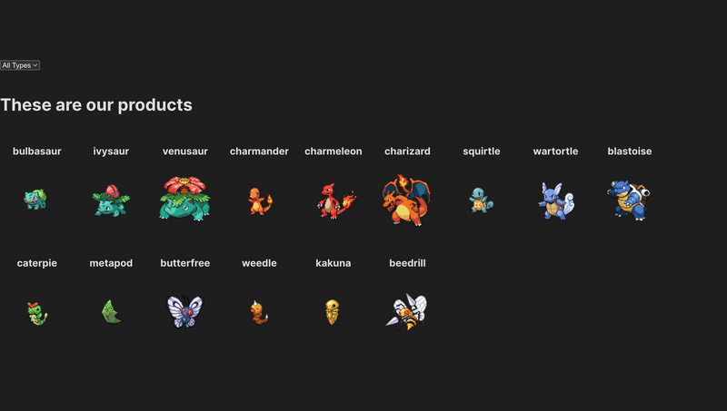

# Smartmon Product Overview Page POC


## Prerequisite environment
- npm: 10.8.2
- node: 20.18.0

## Run a Smartmon Product Overview Page POC
1. Install dependencies.

```bash
npm i
```

2. Run the development server & browse components in Storybook:

```bash
npm run dev
npm run storybook
```

3. Open [http://localhost:5173](http://localhost:5173) for product preview in localhost with your browser to see the result. Open [http://localhost:6006](http://localhost:6006) to browse components in Storybook.

- `src/api/poke-api.ts` is the endpoint related interactions from PokeAPI.
- `src/components/pokemon-list.ts` is the pokemon list component. (With type filter function.)
- `src/stories/pokemon-list.stories.ts` is the Storybook story for pokemon list.

> [!WARNING]
> Style is not implemented to due to the time measurement for this coding challenge task. Also, I made a decision of prioritizing the feature implementation for demonstrating technical skills to the client for presentation.

## Requirements Achievement
- [x] Use lit-ts template
- [x] Use Storybook
- [x] Use Lit
- [x] Use PokeAPI to fetch monster info
- [x] Display all fetched monsters visually to insist as the most important component
- [x] Monster type filter function (i.e. fire, water, earth, etc)

## Future Improvements
- [ ] Styling
- [ ] Clean up stories from default template
- [ ] Component reusability planning (in-depth)